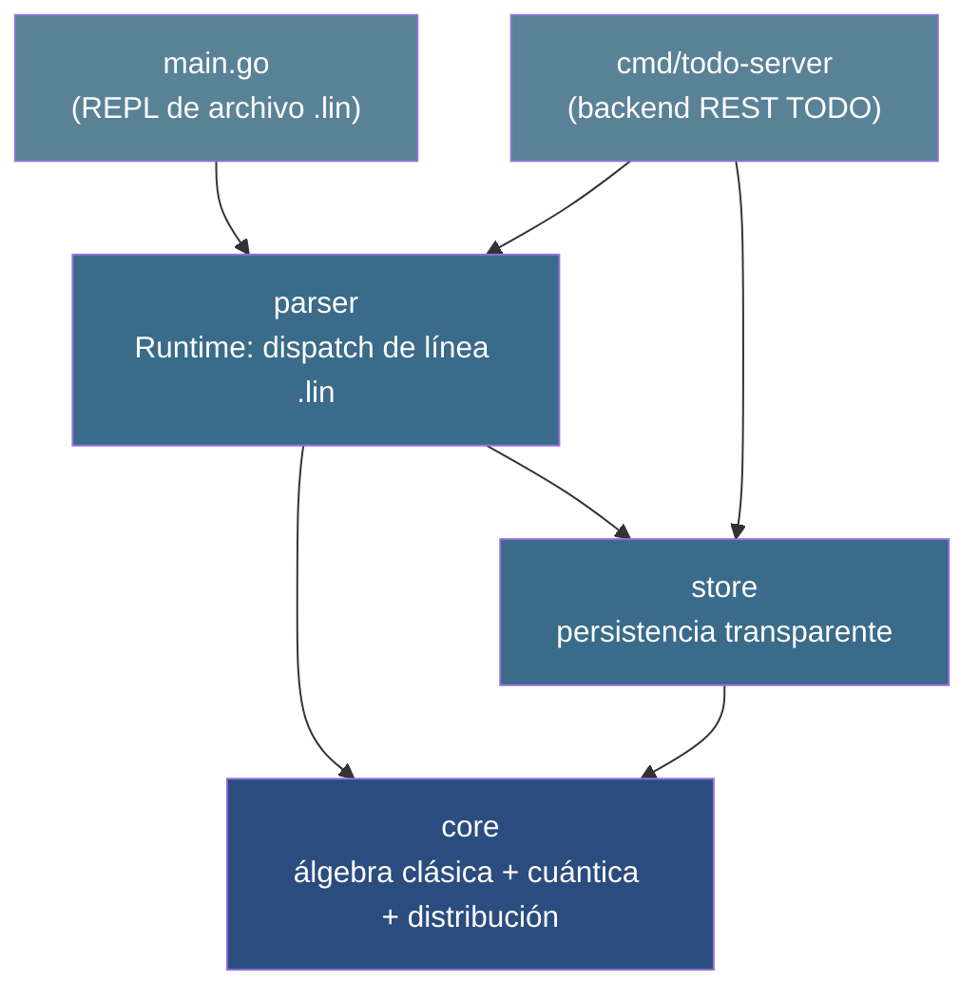
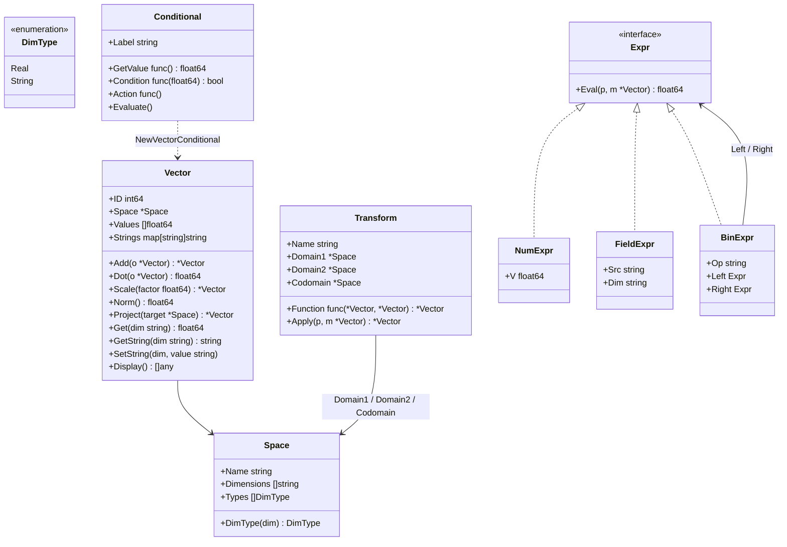
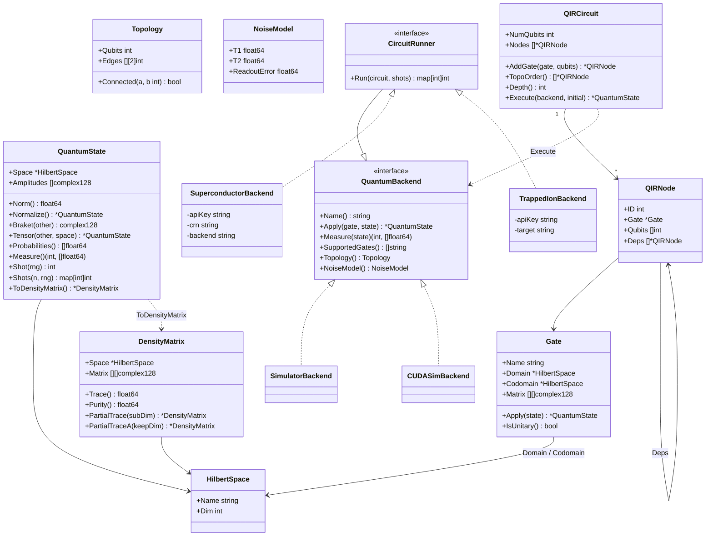
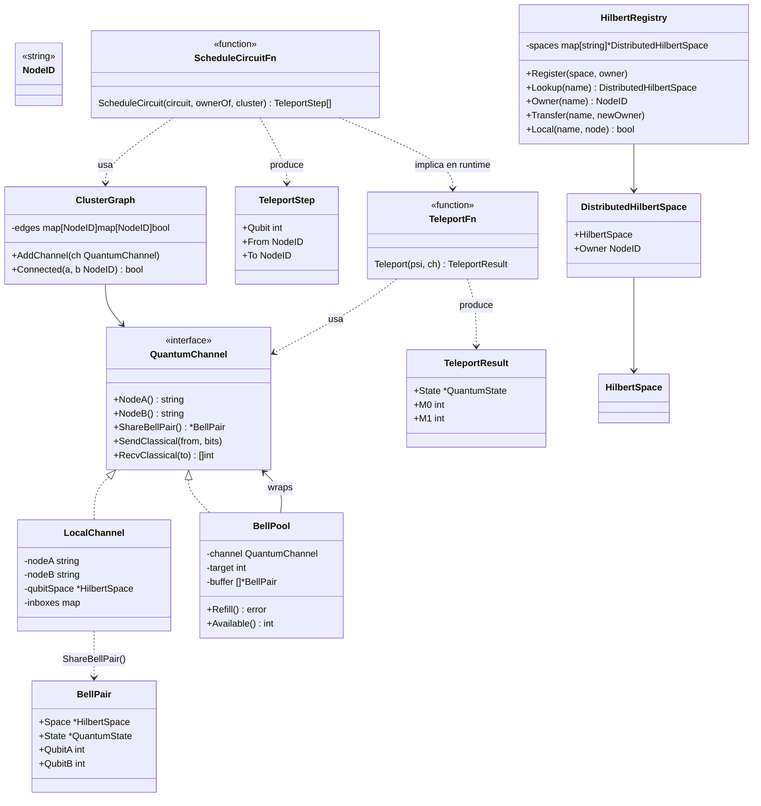
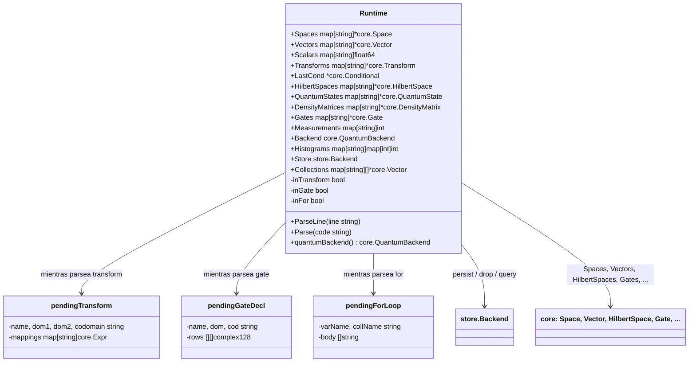
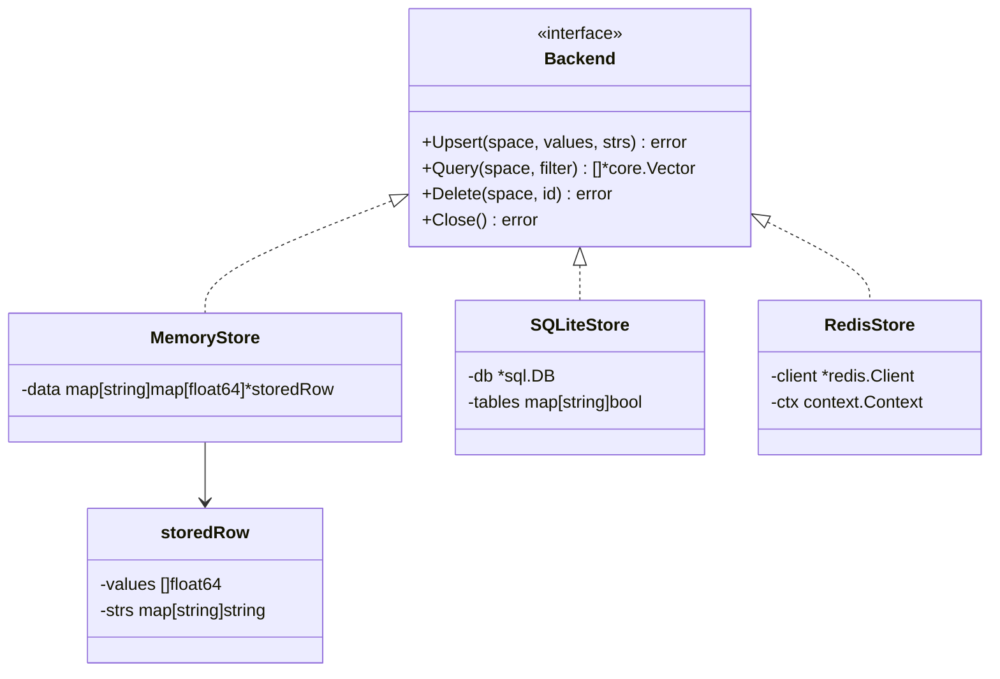
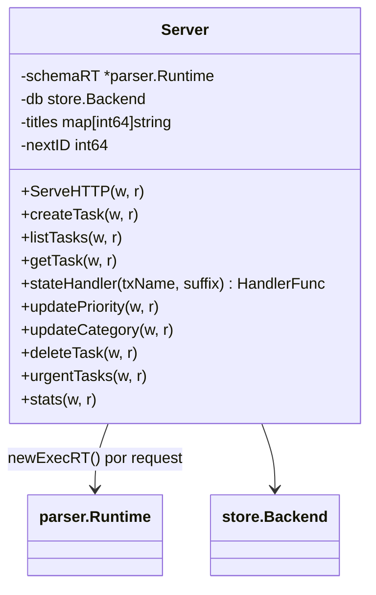
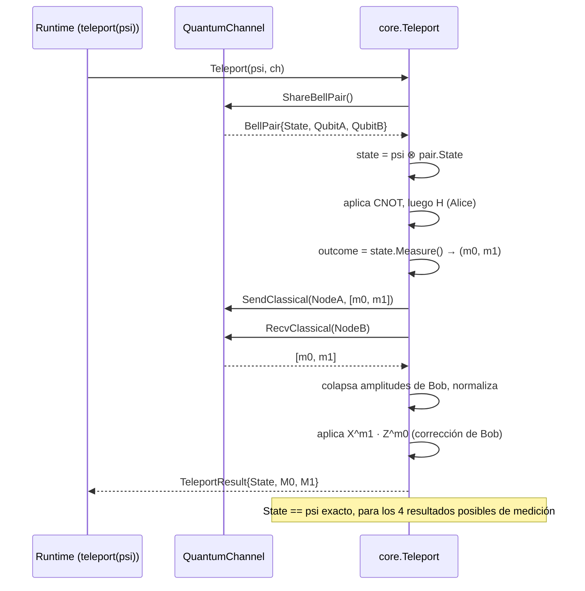
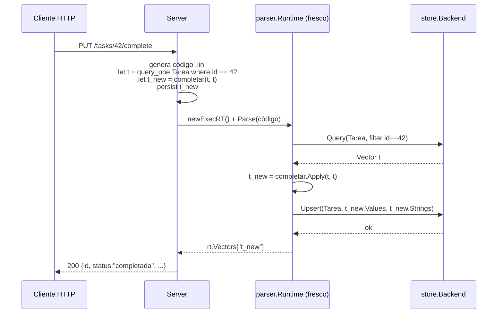

# Arquitectura de LinLang — diagramas UML

> Generado a partir del estado del código en el commit `e9e36fd` (2026-10-08).
> Diagramas en sintaxis [Mermaid](https://mermaid.js.org/) (notación UML de clases y
> secuencia) — GitHub los renderiza automáticamente al ver este archivo.

## 1. Vista de componentes

Cuatro paquetes Go. `core` no depende de nada del proyecto; `store` solo depende de
`core`; `parser` depende de ambos; `cmd/todo-server` y `main.go` son los dos binarios,
ambos thin-shells sobre `parser.Runtime`.

## 2. `core` — álgebra clásica

`Space`/`Vector` son el núcleo vectorial sobre ℝ; `DimType` (issue #24) distingue
dimensiones que participan en la aritmética (`Real`) de las que son metadata (`String`).
`Transform` son los morfismos entre espacios; `Expr` es el parser recursivo-descendente
de expresiones (`p.dim * m.dim / 10`) que alimenta el cuerpo de un `transform`.

## 3. `core` — simulación cuántica (LinLang/Q)

`HilbertSpace` es la especialización de `Space` sobre ℂ. `Gate`/`QuantumState`/
`DensityMatrix` implementan el álgebra de la Sección "Formalización Algebraica" de la
tesis. `QuantumBackend` (issue #1) desacopla el runtime del motor de ejecución;
`CircuitRunner` (issue #3/#4) es el camino para hardware real, que no puede aceptar un
vector de amplitudes arbitrario. `QIRCircuit` (issue #7) es el DAG intermedio que
`OptimizeCircuit` (#8) y `RouteCircuit` (#9) transforman antes de la ejecución.

## 4. `core` — distribución y teleportación

`QuantumChannel` (issue #15) es la abstracción de un enlace cuántico entre dos nodos.
`BellPool` (#17) decora un `QuantumChannel` con un buffer pre-provisionado.
`HilbertRegistry` (#16) registra qué nodo posee cada espacio. `ScheduleCircuit`/
`ClusterGraph` (#18/#19) particionan un circuito entre nodos insertando `Teleport` (#14)
donde haga falta — nunca `SWAP`, porque el no-clonación lo prohíbe (ver
`docs/teleportation.md` y la Sección "Hilbert Spaces Distribuidos" de la tesis).

## 5. `parser` — el intérprete `Runtime`

`Runtime` es el intérprete completo: un diccionario de namespaces (uno por tipo de
valor) más el estado de los bloques multi-línea (`transform { }`, `gate { }`,
`for { }`). No hay AST persistente — cada línea se interpreta y descarta
(`ParseLine`), excepto dentro de esos tres bloques, que acumulan su cuerpo hasta `}`.

## 6. `store` — persistencia transparente

Un único `Backend` con tres implementaciones intercambiables vía `LINLANG_DB`
(`memory://`, `sqlite://`, `redis://`). Desde #24, `Upsert`/`Query` también llevan las
dimensiones `String` (antes se perdían al pasar por el store).

## 7. `cmd/todo-server` — thin shell HTTP

Cada endpoint genera un fragmento `.lin`, lo corre en un `Runtime` fresco (con el
schema precargado) y traduce el `Vector` resultante a JSON. `titles` vive fuera de
LinLang porque el schema `examples/todo.lin` no declara `titulo` como dimensión
`String` — podría migrar a eso ahora que #24 existe, pero no se tocó en esta sesión.

## 8. Secuencia: protocolo de teleportación

`core.Teleport` (issue #14), construido sobre `QuantumChannel` (#15) — ver
`docs/teleportation.md` para la formalización completa.

## 9. Secuencia: request HTTP → LinLang → store

Ejemplo con `PUT /tasks/{id}/complete` — el mismo patrón (generar código `.lin`,
ejecutarlo en un `Runtime` fresco) se repite en los 10 endpoints.

